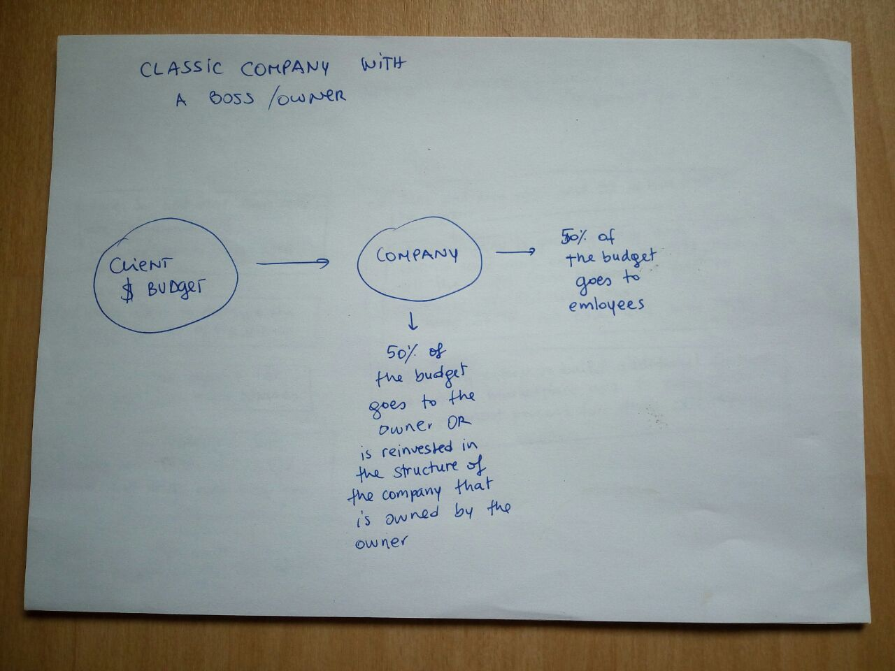
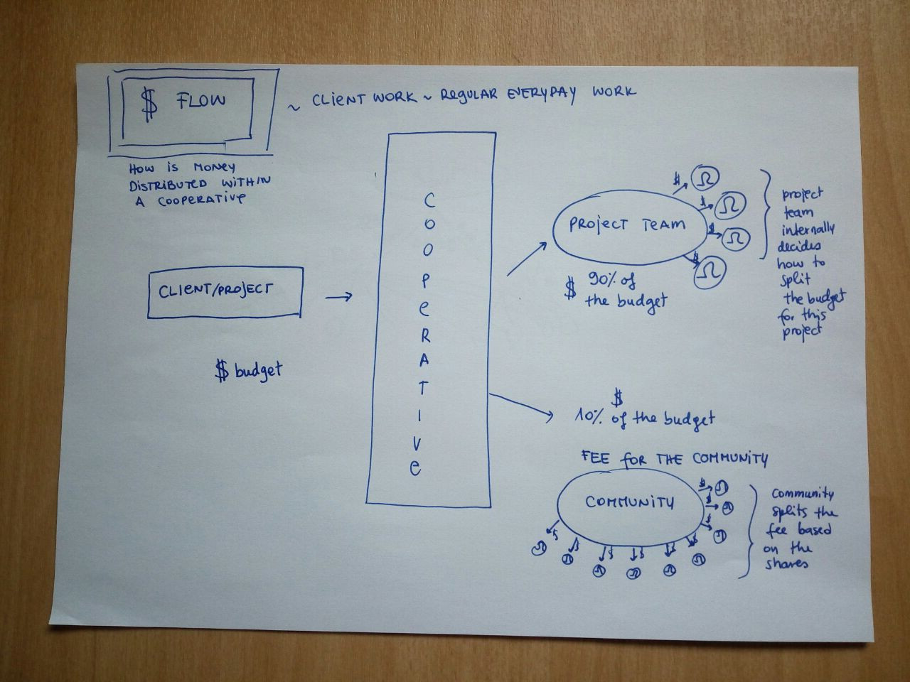
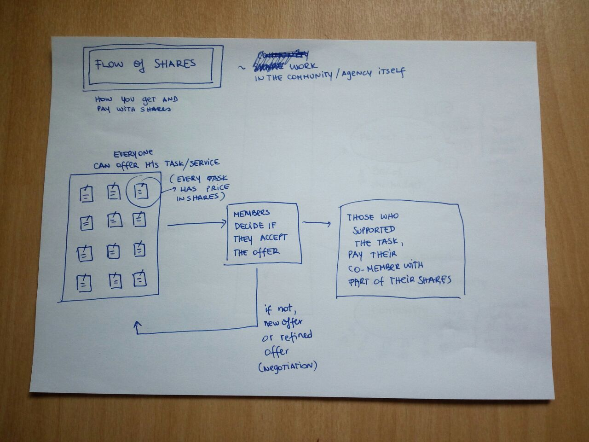
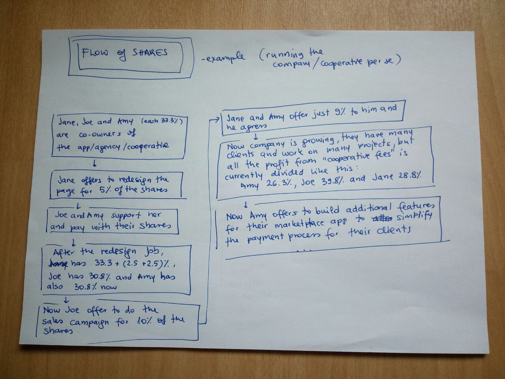
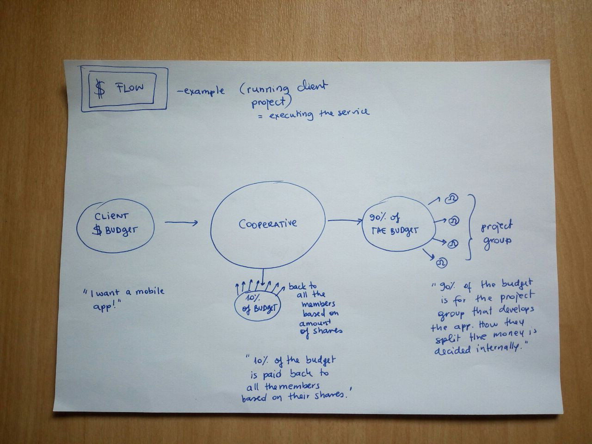

# micro-holding-co-ownership.github.io
Micro Holding Co-Ownership and laws around opening and running a coop in different countries

## contributors & collaboration
**join and talk to us:**
* https://gitter.im/Micro-Holding-Co-Ownership/micro-holding-co-ownership.github.io

**help us research legalities:**
* https://github.com/Micro-Holding-Co-Ownership/micro-holding-co-ownership.github.io/issues
* https://waffle.io/Micro-Holding-Co-Ownership/micro-holding-co-ownership.github.io

This project is part of [squatup](https://github.com/SquatUp/roadmap/issues/6)

# roadmap
create and manage your one-person micro holding company

## modules
* [`microholding`](https://github.com/Micro-Holding-Co-Ownership/microholding) (create and manage your one-person micro holding company)
* [`microholding-cli`](https://github.com/Micro-Holding-Co-Ownership/microholding-cli)(use "microholding" from the command line)

# Value Proposition

### MODEL - first draft

**PROCESS OF VOTING WITH SHARES**

**One-time task**

1. Task - Everyone an create a task
2. Negotiations - We need to set the Price (% of shares) and Deliverables  for this task -  debatable (person himself or others)
3. Contract - set the rules who pays, how much each, and when (now or after the task is done)
4. Payment - the person who created a task, gets shares

**Ongoing task**

1. Task - Everyone an create a task
2. Interval - we set execution interval
3. Negotiations - We need to set the Price (% of shares) and Deliverables per each interval -  debatable (person himself or others)
4. Contract - subscription  that can be cancelled  at the end of each interval/supporters can bail out
5. Payment
6. **Feedback/Upgrade:** opt-out/veto from the payment (before every repetition)

**MEMBERSHIP FEE**

1. Every member pays % for each share she/he owns
2. We vote on amount of membership fee (median of all given votes) - whenever there is a change, new median is applied and users are notified
3. The whole amount is distributed equally to each member (service fee)

## Status Quo

## Vision

